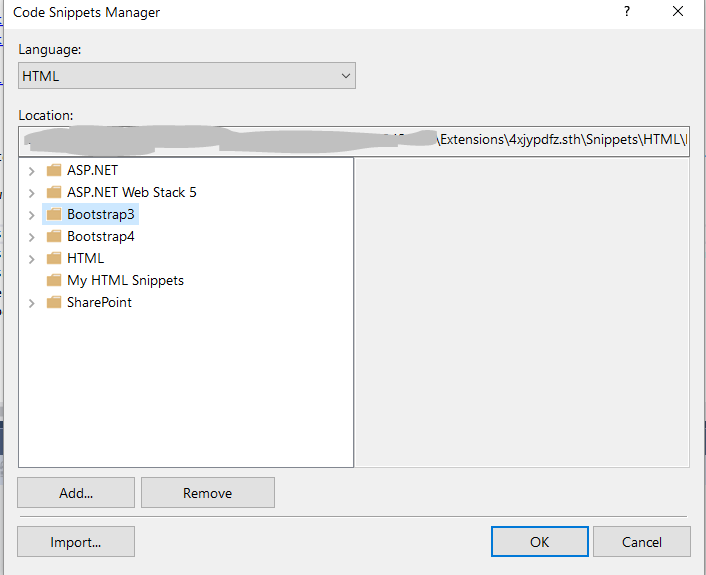

Visual Studio Bootstrap 4 and Bootstrap 3 Snippets 
=====================================

Download this extension from [Visual Studio market place](https://marketplace.visualstudio.com/items?itemName=RADKick.VSBootstrapSnippets)

Inspired by [Eric Lebetsamer's repository](https://github.com/elebetsamer/bootstrap-snippets-visual-studio)

Adding Bootstrap V4 and few more features like contextual themes and sizes. 

Support for BS4 snippets using bs4-, and renamed bs- to bs3- to make it compatible for different versions of bootstrap projects in Visual Studio.

## The ultimate snippet pack for web developers using the Twitter Bootstrap V4 and Bootstrap V3

[Twitter Bootstrap V4](https://getbootstrap.com/) and [Bootstrap V3](https://getbootstrap.com/docs/3.3/) snippets for Visual Studio 2012/2013/2015/2017.

The code snippets are currently based on Bootstrap **4.0.0** and **3.3.7** 

[Bootstrap 4 Snippet Listing](https://github.com/radkick/vs-bootstrap-snippets/blob/master/bs4-snippet-listing.md)
 |  
[Bootstrap 3 Snippet Listing](https://github.com/radkick/vs-bootstrap-snippets/blob/master/bs3-snippet-listing.md)

[Change log](https://github.com/radkick/vs-bootstrap-snippets/blob/master/change-log.md)

## How to use snippets in Visual Studio

you can type <bs4- and then press the TAB key twice. Alternatively, you can type button and then press the TAB key once. When you do, the editor completes the markup for the Button control by inserting the following markup:

However, you can also insert code snippets in the following ways:

* Position the cursor where you want the inserted code snippet to appear, right-click the page, and then select Insert Snippet;
* Position the cursor where you want the inserted code snippet to appear, and then press the keyboard shortcut CTRL+K, CTRL+X *
* A list appears that lets you select a snippet;
* Select a word that you want to surround using a code snippet, and then right-click the word and click Surround With;
* From the Edit menu, select IntelliSense, and then select Insert Snippet (or use shortcut Ctrl+K, Ctrl+B)*.
  
The "Code Snippets Manager" dialog

Note: * for more [Visual Studio shortcuts visit](http://visualstudioshortcuts.com/2017/)

Need more snippets, send me message or connect with me at [Linkedin](https://www.linkedin.com/in/riteshpahwa/)

Todo
----

* Testing BS3- and 
* working on BS4-
